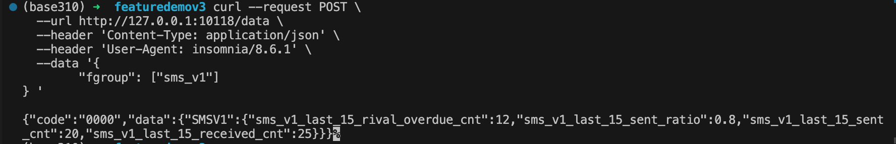

# featuredemov3

## 1. Overview

demo project to show how to obfuscate a python package .

## 2. Usage

### 2.1 init project

```bash
pip install -r requirements.txt

poetry install -v
```

### 2.2 usage

1. how to run
    ```
    cd path_to_this_project

    uvicorn featuredemov3.main:app --reload --port 10118
    # or 
    fstart

    ```
1. how to obfuscate
   ```
   # just run 

   python pyarmor.py

   # then run encoded project
   python encoded_project/cmdline.py 
   ```
1. how to debug
   ```
   curl --request POST \
        --url http://127.0.0.1:10118/data \
        --header 'Content-Type: application/json' \
        --header 'User-Agent: insomnia/8.6.1' \
        --data '{
            "fgroup": ["sms_v1"]
        } '
   ```
    